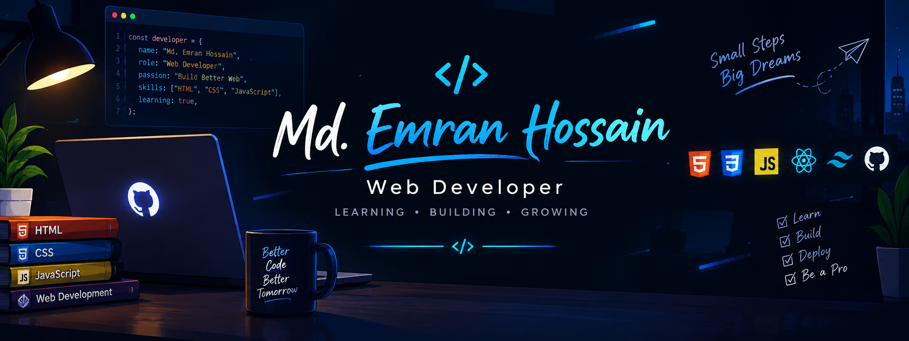

<!-- ========================= BANNER ========================= -->

<p align="center">
  
</p>

<!-- ========================= TYPING ANIMATION ========================= -->

<p align="center">
  
</p>

<p align="center">
  
</p>

---

## 👨‍💻 About Me

Hello! I'm **Md.Emran Hossain**, a passionate **Frontend Developer from Bangladesh 🇧🇩**.

I enjoy creating modern, responsive and user-friendly web interfaces.  
I'm continuously learning new technologies and improving my development skills by building real-world projects.

- 🔭 Currently working on **Upcoming Projects**
- 🌱 Currently improving my **Frontend Development Skills**
- 💻 Passionate about **Modern Web Development**
- 🤝 Open to **collaboration and learning opportunities**
- 🎯 Goal: Become a professional Full Stack Developer
- 📫 Email: **emransani01@gmail.com**

---

# 🛠️ Languages & Tools

### 💻 Frontend Development

<p align="left">

<a href="https://www.w3.org/html/">

</a>

<a href="https://www.w3schools.com/css/">

</a>

<a href="https://developer.mozilla.org/en-US/docs/Web/JavaScript">

</a>

<a href="https://www.typescriptlang.org/">

</a>

<a href="https://react.dev/">

</a>

<a href="https://tailwindcss.com/">

</a>

</p>

### ☕ Programming & Design

<p align="left">

<a href="https://www.java.com/">

</a>

<a href="https://www.adobe.com/products/illustrator.html">

</a>

<a href="https://www.adobe.com/products/photoshop.html">

</a>

</p>

---

# 📊 GitHub Analytics

<p align="center">


</p>

---

# 🔥 GitHub Streak

<p align="center">


</p>

---

# 📈 Contribution Activity

<p align="center">


</p>

---

# 🐍 My Contribution Snake

<p align="center">


</p>

---

# 🚀 My Development Journey

```text
HTML & CSS
     ↓
JavaScript
     ↓
React
     ↓
TypeScript
     ↓
Modern Frontend Development
     ↓
Full Stack Development 🚀
