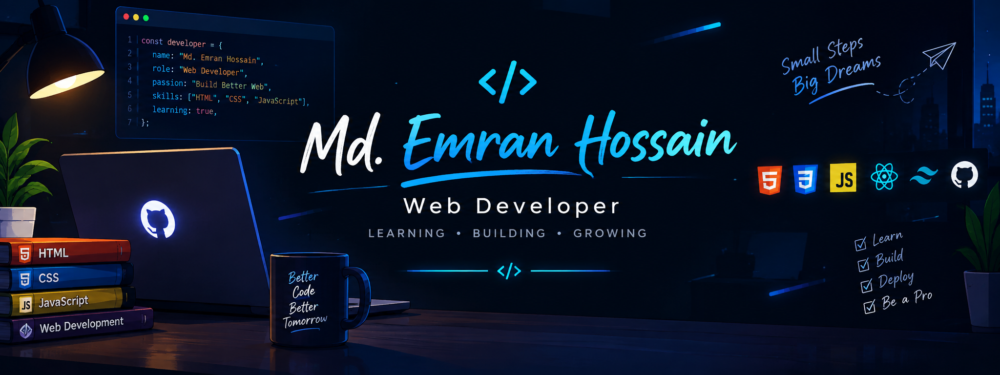

<!-- ========================= BANNER ========================= -->

<p align="center">
  
</p>

<h1 align="center">Hi 👋, I'm Md. Emran Hossain</h1>

<p align="center">
  <strong>Full Stack Developer in Training • Mechanical Diploma Engineer • Lifelong Learner</strong>
</p>

<p align="center">
  <a href="https://github.com/Emransani01">
    
  </a>
  <a href="https://www.linkedin.com/in/emran-hossain-ab4675b1/">
    
  </a>
  <a href="https://www.facebook.com/Emransani40/">
    
  </a>
  <a href="https://x.com/MdEmranSani">
    
  </a>
  <a href="mailto:emransani01@gmail.com">
    
  </a>
</p>

<p align="center">
  
</p>

<!-- ========================= PROFILE VIEWS ========================= -->

<p align="center">
  
</p>

---

# 👨‍💻 About Me

Hello! I'm **Md. Emran Hossain**, a **Mechanical Diploma Engineer** from Bangladesh who is currently building a new career in **Full Stack Web Development**.

My engineering background has helped me develop problem-solving skills, technical thinking, discipline, and a practical approach to learning.

I started my web development journey with **HTML, CSS, and JavaScript** and have continued building my skills with **TypeScript, React, Next.js, Tailwind CSS, and MongoDB**.

Now I'm focused on strengthening my **backend and full stack development skills** while building real-world applications.

* 🇧🇩 Based in **Rampal, Bagerhat, Bangladesh**
* 🎓 **Diploma Engineer in Mechanical Engineering**
* 💻 Building my career in **Full Stack Development**
* ⚡ Comfortable with **HTML, CSS, JavaScript, TypeScript, Tailwind CSS & Next.js**
* 🗄️ Completed learning the fundamentals of **MongoDB**
* 🚀 Interested in building **real-world web applications**
* 🤝 Open to learning, collaboration and developer opportunities
* 🎯 Goal: Become a skilled **Professional Full Stack Developer**
* 📧 Email: **[emransani01@gmail.com](mailto:emransani01@gmail.com)**

---

# 🧑‍💻 My Current Focus

```text
Frontend Development
        ↓
React + TypeScript
        ↓
Next.js + Tailwind CSS
        ↓
Backend Development
        ↓
REST APIs
        ↓
MongoDB & Database Integration
        ↓
Authentication & Authorization
        ↓
Full Stack Development 🚀
